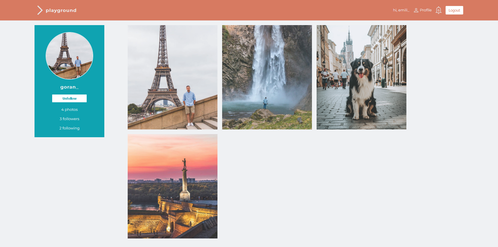
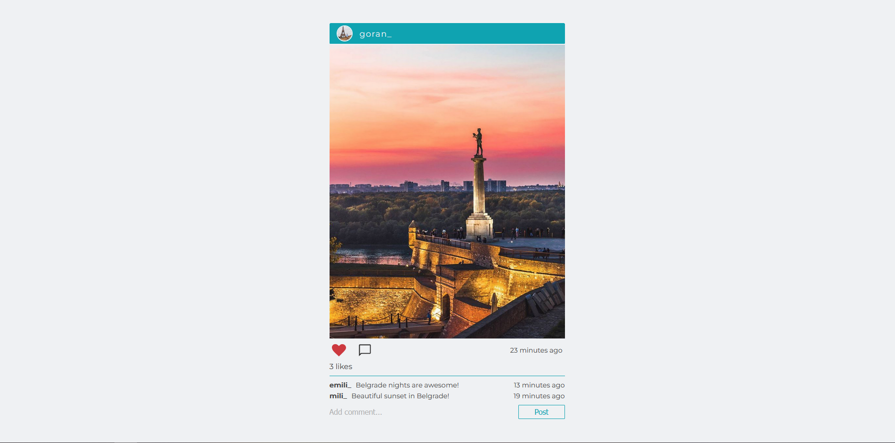

# Playground

Playground is a student project and a full-stack social media application created in the process of learning ReactJS and Firebase.

User can create a profile page, upload photos, find friends, follow them, see their posts on timeline and profile page,
like their photos and make comments.
The user also receives notifications in real-time when another user starts following him, likes his photo or leaves a comment.

Chat functionality will be added in the next upgrade.

